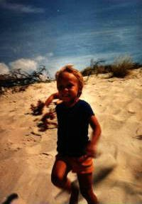

+++
title = "Om"
description = "Om mig, Jesper Lillesø"
date = "2023-07-06"
aliases = ["about-us", "contact"]
author = "Jesper Lillesø"
+++

Jesper Lillesø er en alsidig person med en dyb passion for teknologi. Han kan lide computere (især gamle), han kan lide biler (især gamle) og tager alt for mange fotografier.

## Passion

Biler har altid været min passion (så længe jeg kan huske). 
Først var det det tekniske som hastighed og kraft. 
Nu er det mere skønheden i designene og historien bag mærkerne. 
Det er unødvendigt at sige, at jeg følger udviklingen af biler tæt i medierne.

## Professionel Baggrund

Jesper Lillesø er en erfaren professionel med erfaring i online spilindustrien. Han fungerer i øjeblikket som en nøglefigur hos Spillehallen.dk, en førende virksomhed i den danske online spilsektor. Jesper er kendt for sin strategiske vision og innovative tilgang, der driver betydelig vækst og udvikling inden for organisationen.

Jesper har en grad fra Aarhus Universitet, hvor han udviklede en stærk grundlag i [specifikt felt, f.eks. erhvervsadministration, datalogi]. Gennem årene har han haft forskellige centrale roller i fremtrædende virksomheder, hvilket har bidraget til hans dybe ekspertise i [specifikke områder, f.eks. online spil, digital markedsføring, softwareudvikling].

## Forbindelse

Jesper er altid ivrig efter at forbinde sig med professionelle, entusiaster og branchekolleger. Uanset om det er til potentielle samarbejder, netværk eller deling af indsigter, er du velkommen til at tage kontakt.

For mere information om Jesper Lillesø og hans arbejde, besøg venligst [virksomhedens hjemmeside eller personlig portefølje link].

## Kort Fortalt

- **Køn** Mand
- **Handle** rasta / frogskins
- **Navn** Jesper Lillesø
- **Bopæl** Sjelle, Danmark
- **Fødselsdato** 27. november 1971
- **Fødested** Skt. Maria Hospital, Vejle

## Bopælslog
- **1971-1991** Hoejen, Vejle
- **1991-1996** Aalborg
- **1996-2005** Aarhus
- **2005-** Sjelle

## Uddannelseslog
- **1974-1977** Børnehave, Laila
- **1977-1985** Folkeskole, Hoejen (Hoejen Skole)
- **1985-1988** Folkeskole, Vejle (Damhavnes Skole)
- **1988-1991** Gymnasium, Vejle (Rosborg Amtsgymnasium)
- **1991-1996** Universitet, Aalborg (Aalborg Universitet)
- **1998-2002** Erhvervsskole, Aarhus (Aarhus School of Business)

## Oprindelse af Rasta
Nå - rasta er som du måske har gættet, ikke mit rigtige navn. 
Det er mit handle og går tilbage til de gode gamle Amiga dage. 
Hvorfor rasta? Jeg tror (!) det var en kombination af mange ting. 
Tegneserien af Hergé kaldet Tintin har for eksempel en kriminel med et lignende navn. 
Og navnet blev introduceret, da jeg forsøgte at lave nogle grafik til en lille 
demogruppe (der lavede Amiga demos) kaldet fieldeffect (rasta = raster - forstår du?). 
Vi lavede faktisk ikke meget, men det var trendy på det tidspunkt at være en del af en 
demogruppe (i det mindste i nørdeverdenen). Og at have et sejt handle var endnu mere rart.

## Hvordan man Skriver Mit Navn på Computere
Desværre er mit navn meget upraktisk, når man arbejder med computere. 
tro mig, jeg lider mere end dig. Her er nogle forslag til, hvordan man skriver 
mit navn i forskellige computer miljøer. Denne idé er takket være **sauber**.

- **HTML** `Jesper Lilles&oslash;`
- **LaTex** `Jesper Lillesø`
- **PostScript** `Jesper Lilles\370`
- **7-bit ASCII** `Jesper Lillesoe`
- **PC Tastatur** `Jesper Lilles[Alt]0248`
- **SUN Tastatur** `Jesper Lilles[Compose]o/`
- **Skrivemaskine** `Jesper Lilleso[Backspace]/`

## Geek Code
```
-----BEGIN GEEK CODE v 3.12 BLOCK-----
GCS/M/B d- s-: a- c++++ UL++++ US++++ P++++$ L++ E W++ N+ o+ K- w
O? M-- V PS+ PE+++ Y PGP- t 5?  X- !R tv+ b+ DI++ D- G e+++ h r?
y+>+++++
------END GEEK CODE BLOCK------
```




