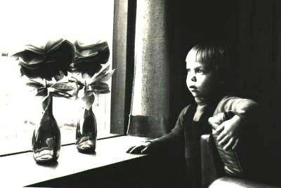

+++
title = "About"
description = "About me, Jesper Lillesø"
date = "2023-07-06"
aliases = ["about-us", "contact"]
author = "Jesper Lillesø"
+++

Jesper Lillesø is a multifaceted individual with a deep passion for technology. He likes computers (especially old ones), he likes cars (especially old ones) and takes too many photograhps.

## Passion

Cars have always been my passion (at least as long as I remember). 
First it was the technical stuff like speed and power. 
Now it is more the beauty of the designs, and the history behind the brands. 
There is no need to say that I follow the evolution of cars closely in the media.

## Professional Background

Jesper Lillesø is a seasoned professional with experience in the online gaming industry. He currently serves as a key figure at Spillehallen.dk, a leading company in the Danish online gaming sector. Jesper is known for his strategic vision and innovative approach, driving significant growth and development within the organization.

Jesper holds a degree from Aarhus University, where he developed a strong foundation in [specific field, e.g., business administration, computer science]. Over the years, he has held various pivotal roles in prominent companies, contributing to his deep expertise in [specific areas, e.g., online gaming, digital marketing, software development].

## Connect

Jesper is always eager to connect with professionals, enthusiasts, and industry peers. Whether it's for potential collaborations, networking, or sharing insights, feel free to reach out.

For more information about Jesper Lillesø and his work, please visit [company website or personal portfolio link].

## In Short

- **Gender** Male
- **Handle** rasta / frogskins
- **Name** Jesper Lillesø
- **Residence** Sjelle, Denmark
- **Birthdate** November 27th, 1971
- **Birthplace** Skt. Maria Hospital, Vejle


## Residential Log
- **1971-1991**	Hoejen, Vejle
- **1991-1996**	Aalborg
- **1996-2005**	Aarhus
- **2005-**	Sjelle

## Educational Log
- **1974-1977**	Kindergarten, Laila
- **1977-1985**	Primary School, Hoejen (Hoejen Skole)
- **1985-1988**	Primary School, Vejle (Damhavnes Skole)
- **1988-1991**	Gymnasium, Vejle (Rosborg Amtsgymnasium)
- **1991-1996**	University, Aalborg (Aalborg University)
- **1998-2002**	Business College, Aarhus (Aarhus School of Business)

## Origin of Rasta
Well - rasta is as you might have guessed, not my real name. 
It is my handle and goes way back to the good old amiga days. 
Why rasta? I think (!) it was a combination of many things. 
The catoon by Hergé called Tintin, for example, has a criminal with a similar name. 
And the name was introduced when I was trying to do some graphics for a little 
demo group (doing amiga demos) called fieldeffect (rasta = raster - get it?). 
We actually didn't do much, but it was trendy at the time to be part of a 
demo group (at least in the nerd world). And having a nice handle was even more nice.

## How to Write My Name on Computers
Unfortunately my name is very inconvenient when working with computers. 
believe me, I suffer more than you. Here are some suggestions how to write 
my name in different computer environments. This idea is in coutesy of **sauber**.

- **HTML** `Jesper Lilles&oslash;`
- **LaTex** `Jesper Lillesø`
- **PostScript** `Jesper Lilles\370`
- **7-bit ASCII** `Jesper Lillesoe`
- **PC Keyboard** `Jesper Lilles[Alt]0248`
- **SUN Keyboard** `Jesper Lilles[Compose]o/`
- **Typewriter** `Jesper Lilleso[Backspace]/`

## Geek Code
```
-----BEGIN GEEK CODE v 3.12 BLOCK-----
GCS/M/B d- s-: a- c++++ UL++++ US++++ P++++$ L++ E W++ N+ o+ K- w
O? M-- V PS+ PE+++ Y PGP- t 5?  X- !R tv+ b+ DI++ D- G e+++ h r?
y+>+++++
------END GEEK CODE BLOCK------
```





